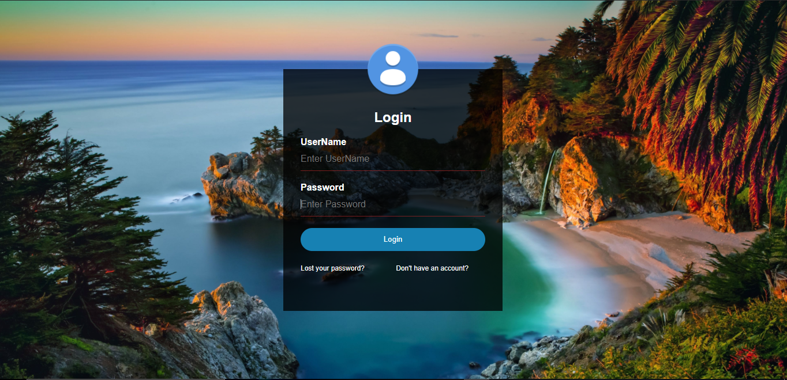

# Login

Esse projeto foi minha primeira experiência com design de login. Então ela é simples e feito utilizando HTML, Css e Javascript.
O projeto brinca com posicionamento usando position: relative e absolute, além de usar uma imagem aléatoria no fundo. kkkkk

